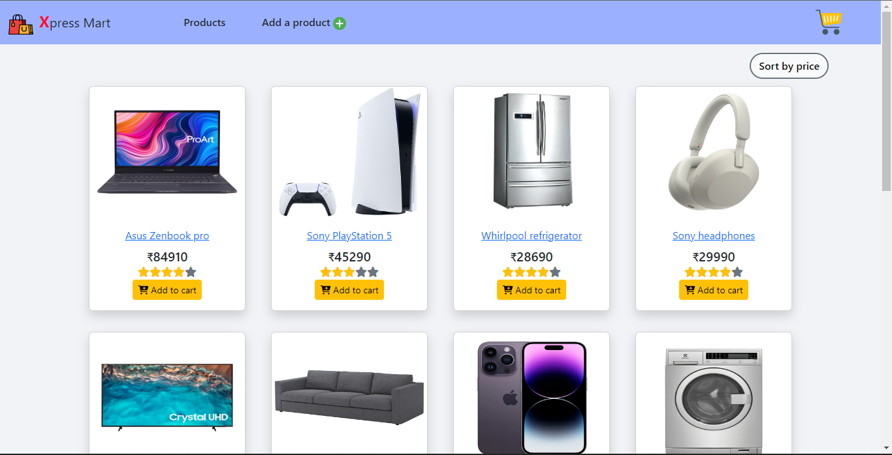
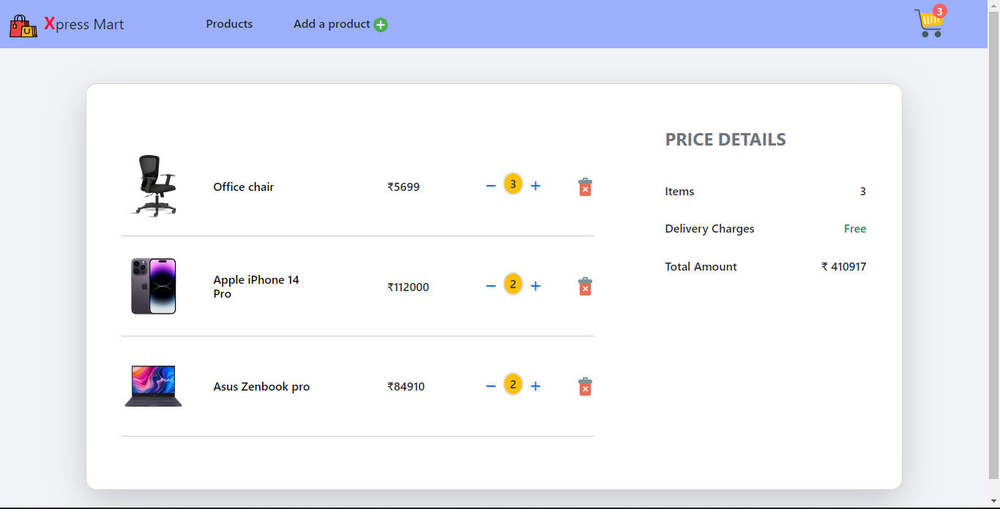
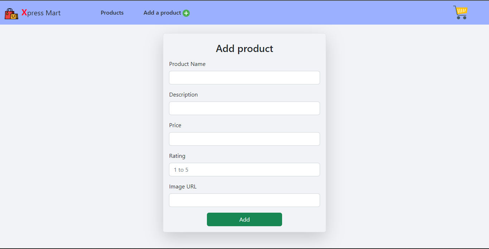
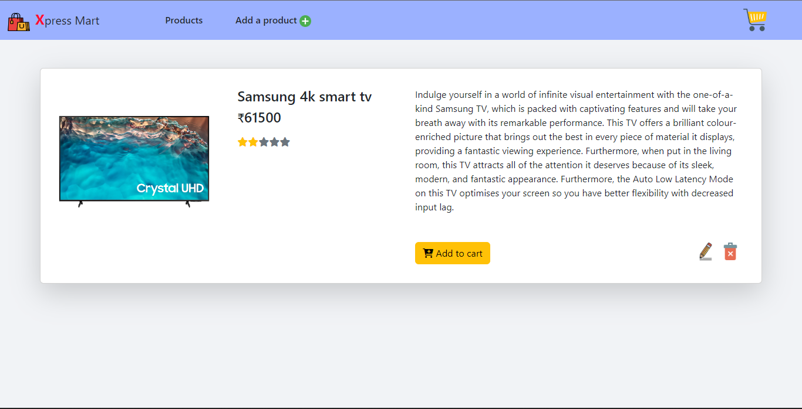
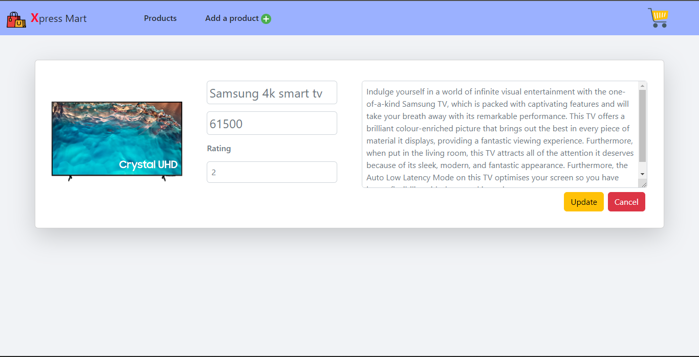

# Xpress Mart React App

This is an eCommerce project, which is built using React with redux to store data. https://my-json-server.typicode.com/ API has been used for creating dummy product data. Bootstrap is used for styling. Product can be added, or removed from the cart. Product can be added, updated, or deleted from the redux store.

### 🔗 Hosted link: [Xpress Mart](https://xpressmart.netlify.app/)



## Getting Started with the project

- Fork the project
- Clone the forked repository in your local system
- Run command to start the project
- Install all required packages

```bash
npm install
```

- Run project

```bash
npm start
```

Runs the app in development mode.\
Open [http://localhost:3000](http://localhost:3000) to view it in your browser.

## ⚙️ Functionality

- Add product
- Update product
- Delete product
- Add product to cart
- Remove the product from the cart
- Increase and decrease the quantity in the cart
- Sort products by price on the home page

## 📄 Pages

- Home page (all products)
- Add product page
- Cart page (products in cart)
- Product page (product can be updated and deleted)

## ⚒️ Tools and libraries

- React
- Bootstrap
- react-redux
- redux-thunk
- react-router-dom
- redux-persist
- react-hot-toast

## 🖥️ Screenshots





